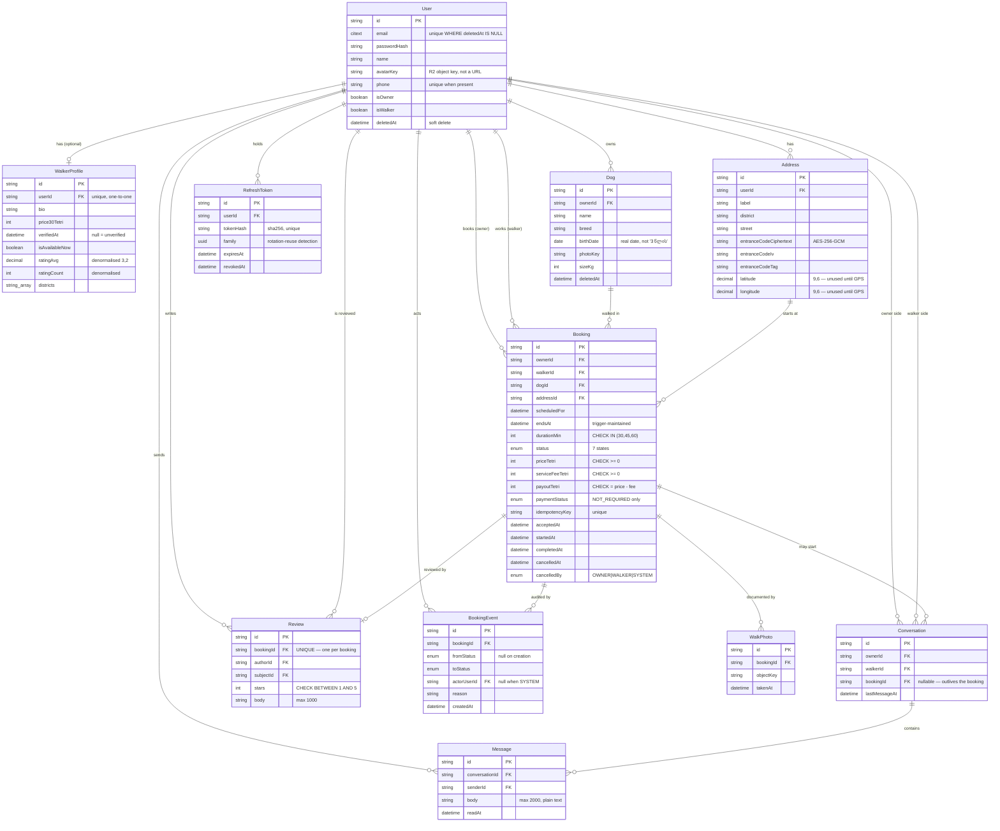
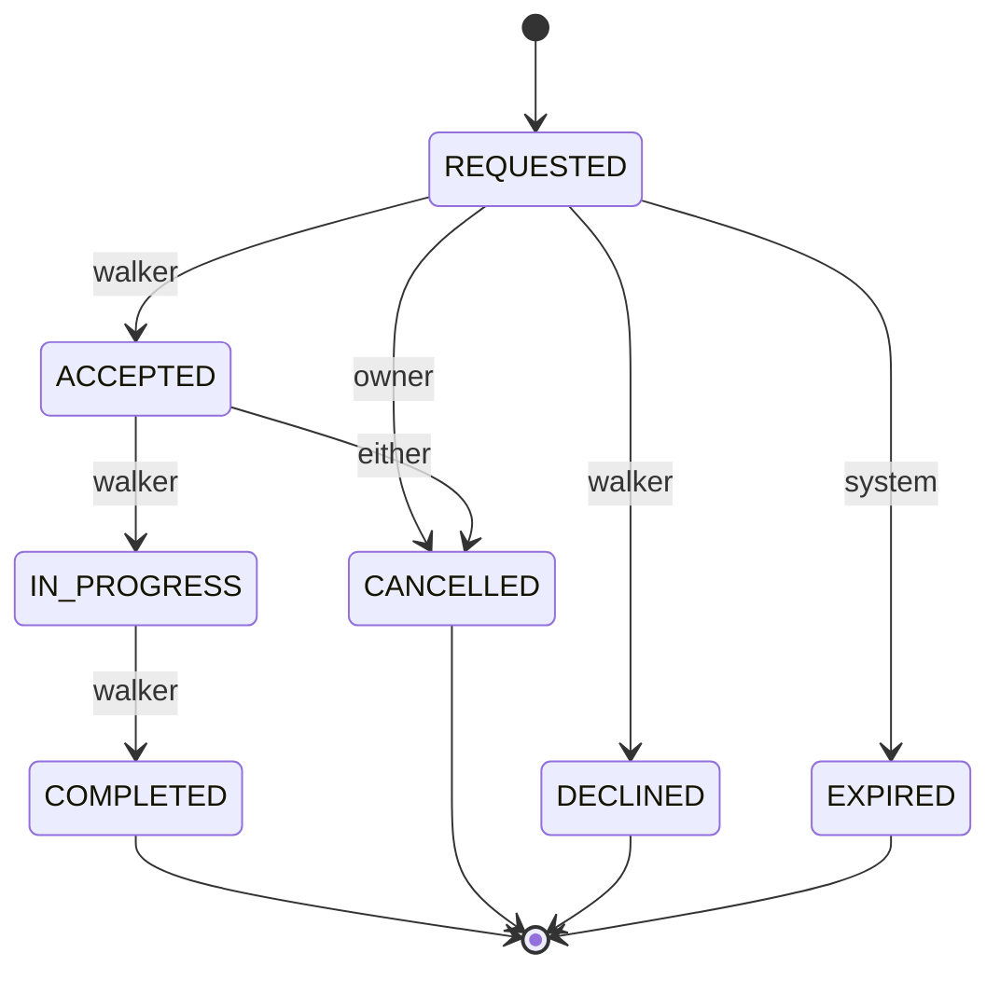

# ModiModi — entity relationship diagram

Generated from `server/prisma/schema.prisma` at Phase 1. Regenerate by hand when
the schema changes; a diagram that drifts is worse than none.

Money is `Int`, in **tetri** (1 GEL = 100 tetri). Times are `timestamptz`.



## Booking status



Seven states, not the demo's three: the demo never had to represent a request
the walker simply ignored. The transition table is implemented in Phase 4.

## What the database enforces, not the application

These live in hand-written SQL at the end of
`server/prisma/migrations/*/migration.sql`. They are the rules that must hold
even if a service has a bug.

| Rule | Mechanism |
| --- | --- |
| A walker cannot hold two overlapping live bookings | `EXCLUDE USING gist` on `("walkerId", tstzrange(scheduledFor, endsAt))`, filtered to `ACCEPTED`/`IN_PROGRESS` |
| `endsAt` always equals `scheduledFor + durationMin` | `BEFORE INSERT OR UPDATE` trigger |
| `payoutTetri = priceTetri - serviceFeeTetri` | `CHECK` |
| No negative money | `CHECK` |
| Duration is 30, 45 or 60 | `CHECK` |
| Stars are 1–5 | `CHECK` |
| One review per booking | `UNIQUE` on `bookingId` |
| Email unique among live accounts only | partial unique index `WHERE deletedAt IS NULL` |
| Email is case-insensitive | `citext` |

### Why `endsAt` exists at all

The natural design is a generated column holding a `tstzrange`. Postgres refuses
it:

```
ERROR:  generation expression is not immutable
```

`timestamptz + interval` is **STABLE**, not IMMUTABLE, because month and day
arithmetic depends on the session `TimeZone`. A stable expression is allowed in
neither a generated column nor an index expression, and the exclusion constraint
is an index. Two plain `timestamptz` columns give `tstzrange(a, b)`, which *is*
immutable. The trigger stops `endsAt` drifting from `durationMin`.

`tstzrange` is half-open `[)`, so a walk ending at 11:00 and one starting at
11:00 do not conflict — which is the behaviour you want.
